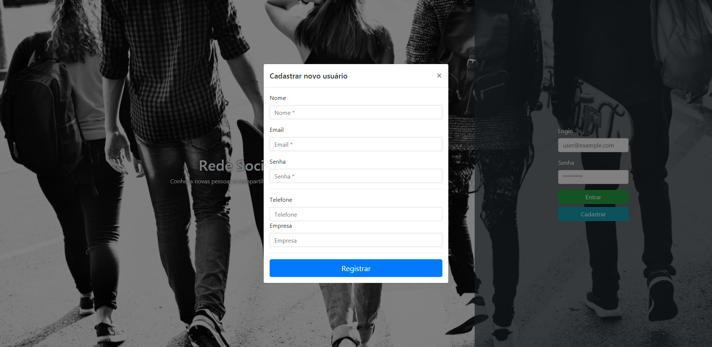
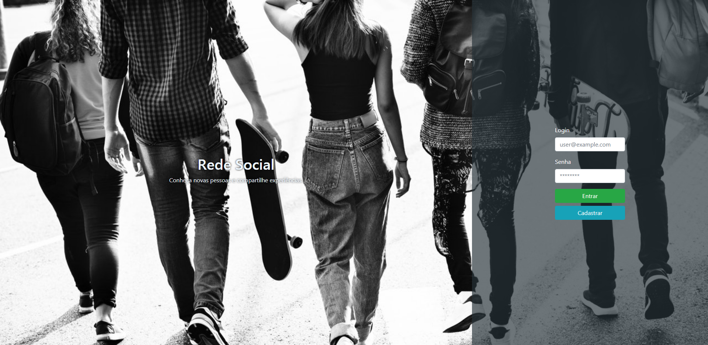
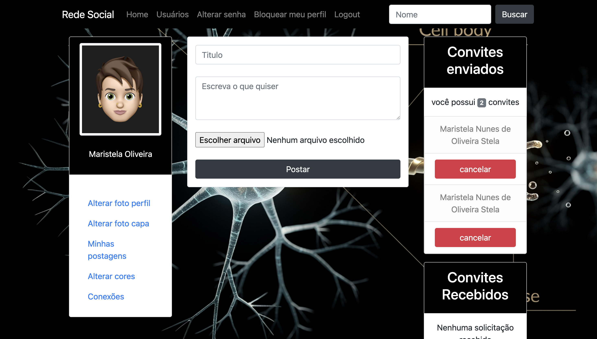

<h1 align="center">
:bird: Social Network
</h1>

<p align="center">


</p>

# Screenshots





## Dependencias
 
 * Instalar requirements
 
 ```
 pip install -r requirements.txt
 ```

 * Instalar dependencia extra

 ```
python -m pip install pillow
```

## Install

 ```
> git clone https://github.com/maristelaoliveira/rede-social.git
> cd social-network
> python manage.py makemigrations
> python manage.py migrate
 ```
